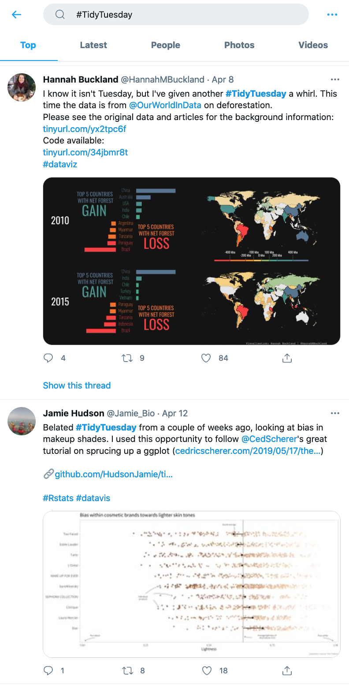
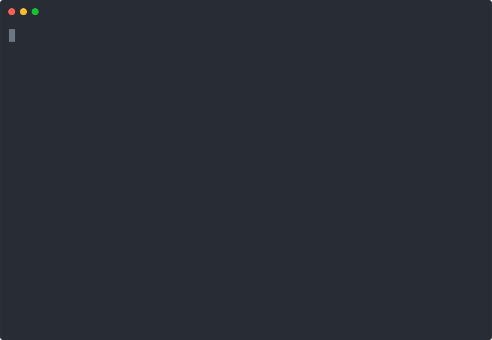
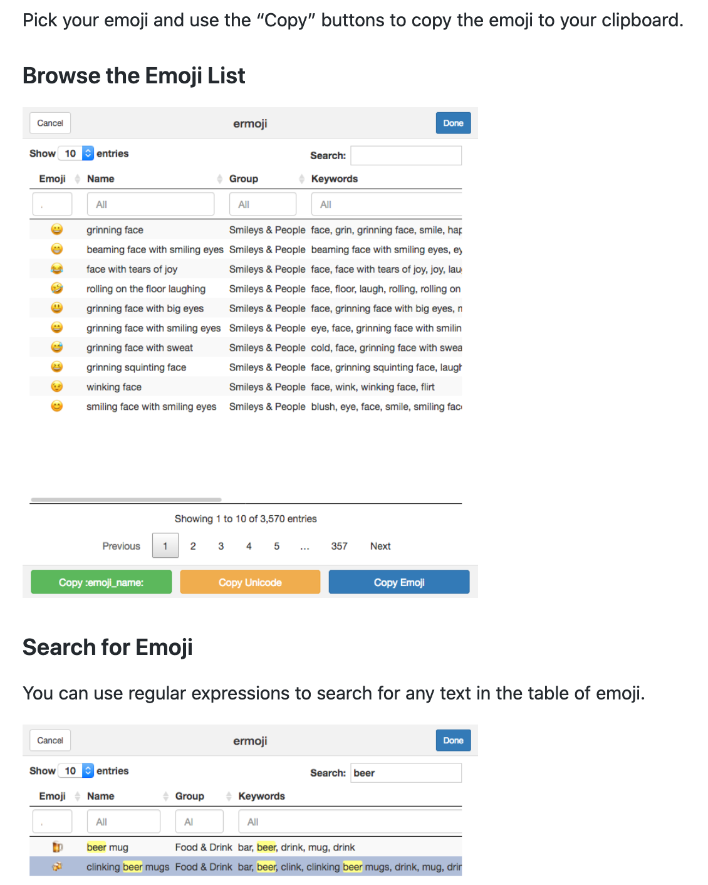
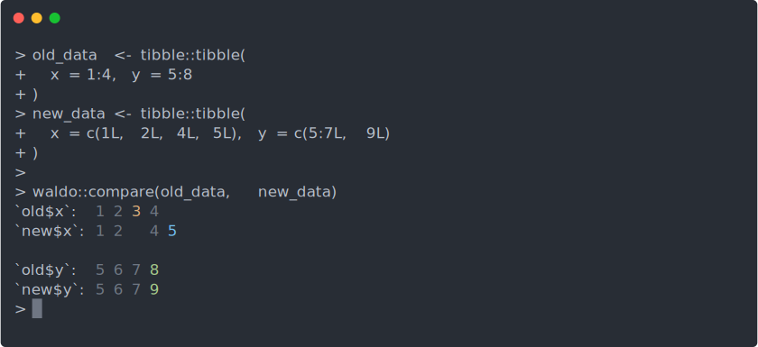

```{r setup, include=FALSE}
options(htmltools.dir.version = FALSE)
knitr::opts_chunk$set(
  fig.width=9, fig.height=3.5, fig.retina=3,
  out.width = "100%",
  cache = FALSE,
  echo = TRUE,
  message = FALSE, 
  warning = FALSE, 
  hiline = TRUE
)

library(icons)
link_icon <- icon_style(fontawesome("link", style = "solid"), scale=.5, fill="#FE6B00", 'margin-bottom' = "8px")
```

name: title
class: left bottom hide-count

<!-- Title Slide -->

<!-- cassette css credit: https://codepen.io/wangchristy/pen/EjdOzK --> 
<link href="https://netdna.bootstrapcdn.com/font-awesome/4.0.3/css/font-awesome.css" rel="stylesheet">
  <div class="fixedContainer">
    <div class="cassette-top">
      <div class="cassette-inner-1">
         <ul class="rainbow-strips">
            <li class="purple">
            </li>
            <li class="red">
            </li>
             <li class="orange">
           </li>
           <li class="green">
           </li>
          </ul>
        <div class="cassette-inner-2">
          <div class="wheel-left">
            <div class="wheel-inner">
              <i class="fa fa-cog fa-spin"></i>
            </div>
          </div>
          <div class="center-box">
          </div>
          <div class="wheel-right">
            <div class="wheel-inner">
              <i class="fa fa-cog fa-spin"></i>
            </div>
          </div>
        </div>
      </div>
    </div>
    <div class="cassette-bottom">
    </div>
  </div>

<link rel="stylesheet" href="https://fonts.googleapis.com/css?family=Mansalva">
.talk-meta[
.talk-title-custom[
# `r rmarkdown::metadata$title`

`r rmarkdown::metadata$subtitle`
]

.talk-author[
`r paste(rmarkdown::metadata$author, collapse = " &middot; ")`<br>
.moffitt-gray[`r paste(rmarkdown::metadata$institute, collapse = ", ")`]
]

.talk-date.moffitt-gray[
`r knitr::knit(text = rmarkdown::metadata$date)`
]
]


    
```{css echo=FALSE}
/* Define title slide image or logo here */
.talk-logo {
  width: 400px;
  height: 750px;
  position: absolute;
  top: 6%;
  right: 7%;
  /* background-image: url('img/r4ds-cover.png'); */
  background-size: contain;
  background-repeat: no-repeat;
  background-position: contain;
}
```

---
### Why this talk?

> I believe every time I am in meeting with Travis, he mentions R packages to analyze & visualize data, create fancy presentations, etc.  In other words, Travis knows R packages for everything.

.right[.small[&#x2014; Rodrigo Carvajal]]

---
### Why this talk?

> I believe every time I am in meeting with Travis, he mentions R packages to analyze & visualize data, create fancy presentations, etc.  <strike>In other words, Travis knows R packages for everything.</strike>

.right[.small[&#x2014; Rodrigo Carvajal]]

<br>

> I believe every time I am in meeting with Travis, he mentions R packages to analyze & visualize data, create fancy presentations, etc.  .red[In other words, Travis spends too much time on Twitter.]

.right[.small[&#x2014; Me]]

---
### Follow these resources!

.pull-left[

- [@icymi_r](https://twitter.com/icymi_r)
  - R posts you might have missed!
  - Searchable history [here](https://alastairrushworth.github.io/searchable/searchable.html)
  
- [@dataandme](https://twitter.com/dataandme)  
  - The OG "in case you missed it" of R Twitter

- [&#35;TidyTuesday](https://twitter.com/search?q=%23TidyTuesday)
  - [@thomas_mock](https://twitter.com/thomas_mock) to participate

- [@grrrck](https://twitter.com/grrrck/) needs no introduction

]

.pull-right[

.position-top[

]

]

---
class: inverse, center

<br><br>
<span style="font-size:1.35em">And now</span><br>
<span style="font-size:3em">in no particular order</span><br>
<span style="font-size:1.23em">are a bunch of</span><br>
<span style="font-size:5em; font-family: Mansalva">secret tRacks</span>

<br><br>
.small.red[I will not do full demos: feel free to interrupt for clarification.]

---
### Let [`pak` `r link_icon`](https://pak.r-lib.org/) install your packages

It's faster and more convenient (e.g. for BioC / GitHub) than `devtools`, `remotes`, and `install.packages`

.w-50.h-center[

]

---
### [`asciicast` `r link_icon`](https://github.com/r-lib/asciicast) will make animated `.svg` &#x1F92F;

- Works for recording R console input/output
  - Way more lightweight than `.gif` or `.mov` formats
  - See [`images/make-star-wars-svg.R`](images/make-star-wars-svg.R) in [this repo](https://github.com/tgerke/secret-tracks) for the below

.w-50.h-center[

]

---
### Find html/unicode for emojis with [`ermoji` `r link_icon`](https://github.com/gadenbuie/ermoji)

.w-40.h-center[

]

---
### Use web icons with [`icons` `r link_icon`](https://pkg.mitchelloharawild.com/icons/) &#x1F448;

.small[
- Includes: 
  - Font Awesome
  - Ionicons
  - Academicons
  - Simple Icons
  - Google’s Material Design
  - Octicons
  - Feather Icons
]

```{r}
icons::fontawesome("dna", style = "solid")
icons::ionicons("git-pull-request-outline")
```

---
### View object differences with [`waldo` `r link_icon`](https://waldo.r-lib.org/)

This is much nicer to use than `all.equal()`

.w-75.h-center[

]

```{css, echo=FALSE}
.h-center {
  margin: 0 auto;
}
.v-center {
  display: flex;
  justify-content: center;
  align-items: center;
}
.w-75 {
  width: 75%;
}
.w-50 {
  width: 50%;
}
.w-40 {
  width: 40%;
}
.w-25 {
  width: 25%;
}
.fixedContainer {
  position: fixed;
  width: 400px;
  height: 100px;
  left: 20%;
  top: 10%;
  margin-left: -200px; /*half the width*/
}
.talk-title-custom h1 {
  margin-top: 0;
  margin-bottom: 20px;
  font-family: "Mansalva";
}
.position-top {
  position: fixed;
  top: 0;
  left: 60%;
  width: 25%;
}
```
